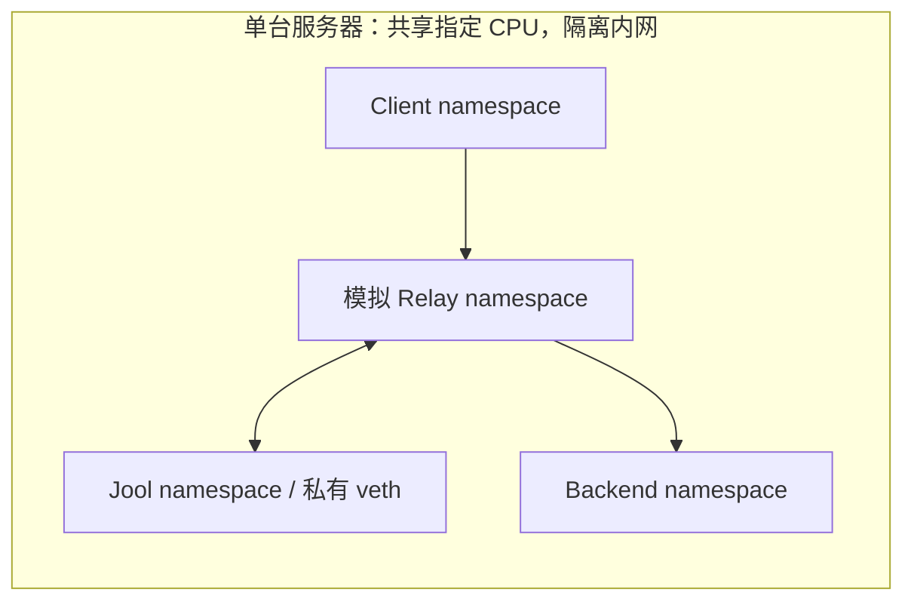

# nftpf / Jool 配置推荐与四轮测试汇总

**推荐基线：跨 IP 家族使用 Jool，保持 pacing 关闭、正常 MTU 和原有 offload；同 IP 家族沿用普通 nftables。** 每流 300 Mbps 只是在此前 HK/TW 公网路径上有效的候选参数，不能作为通用高速配置。

这里合并两轮既有公网大测试，并按用户要求先在 HK VPS A 隔离内网测试、清理，再在 HK VPS B 隔离内网复验。公网与内网、单连接与四连接、最大负载与固定负载分别解释，不混算一个“最高速度”。

发布准备：配置预设、`--jool-pacing` 和实际队列核验在 [PR #4](https://github.com/endview/nftpf/pull/4) 中准备随 v0.3.1 发布；[v0.3.0](https://github.com/endview/nftpf/releases/tag/v0.3.0) 的安装脚本不支持这些开关。完整吞吐测试使用 `c4597ab2de066deba3a709417f981a5861d99dcf`。v0.3.1 的预设复用相同数值配置与转换路径，新增操作另做功能回归，不把旧测速标为新版本重新测速。

## 场景选择

| 场景 | 建议 | 判断依据 |
| --- | --- | --- |
| IPv4→IPv4、IPv6→IPv6 | 普通 nftables；无需经过 Jool | 避免额外转换路径，内网对照使用相同客户端/后端 |
| 跨家族内网，或公网吞吐已达标、丢包较少 | pacing 关闭，保持现有 MTU/offload | 两台内网机器默认路径均达到数 Gbps；300 Mbps 上限会压低单连接和多连接吞吐 |
| 公网多连接重传多、吞吐波动大，但转发机仍有 CPU 余量 | 交替测试 off 和若干每流速率，选稳定接收率较高的值 | HK/TW 的 300 Mbps 候选有效；500 Mbps 更差，不能按参数值推算实际速度 |
| 单连接需要超过 300 Mbps | 保持 off，或验证更高上限 | 每流上限约束真实 TCP/UDP 传输流，不能把四路约 1.1 Gbps 当成单路千兆 |
| UDP、高包率、QUIC 等流量 | 先验证实际发送率、接收率和接收端丢包；上限需覆盖单流需求和头部开销 | pacing 同时作用于 UDP；高负载出现队列丢弃、接收缓冲区错误和发送端不足 |
| 单核 VPS | 优先保留 GSO/TSO、核验 CPU/包率；不统一启用 RPS/XPS | 多核分流需要可用核心和队列，不能为单核提供额外算力 |

这是配置选择建议；本次没有把这些实验参数应用到生产节点。

## 两轮公网大测试

共同路径是 **TW VPS 客户端 → HK VPS 转发 → TW VPS 后端**，包含两段公网，台湾两端共用单核。HK 为 EPYC 7513 / 6.1.0-52-cloud-amd64，TW 为 Xeon Gold 6133 / 6.1.0-49-cloud-amd64。两轮均用 iperf3 3.12、Realm 2.9.6、匹配的 Jool 内核/工具 4.1.15。

| 批次 | 覆盖 | 可支持的结论 |
| --- | --- | --- |
| 2026-10-05/06 基础对照 | 58 项吞吐；初轮 4 秒+1 秒预热、复测 15 秒+3 秒；另有 100 Mbps 固定 TCP 8 秒+2 秒及 UDP | 此路径 Realm 不限速 TCP 较高；固定 100 Mbps 时 Jool 的 HK 整机 CPU 较低。短、长样本波动很大，不能据此估算 Jool 固定容量 |
| 2026-10-06 调优对照 | 44 项吞吐，30 秒+3 秒预热；40 项有效，4 项 CUBIC/BBR 混合样本排除但保留 | namespace-only fq 300 Mbps/flow 在这条路径改善四路吞吐；不支持通用默认值 |

| 基础复测项目 | Jool 接收 Mbps | Realm 接收 Mbps |
| --- | --- | --- |
| v6→v4，单路正向 / 反向 | 60.99 / 175.75 | 1477.51 / 1480.07 |
| v4→v6，四路正向 / 反向 | 337.28 / 373.18 | 1788.64 / 1888.15 |

固定 100 Mbps 的八项 TCP 均收到 99.50–100.02 Mbps：Jool 的 HK CPU 为 3.11–4.67%，Realm 为 7.37–13.66%。这是单核整机观察值，包含采样与业务背景负载。单腿直连参考 1893.72/1749.60 Mbps 与两腿转发不同，不当成转发效率比。

| 调优复测，v6→v4 四路正向 | 接收 Mbps | 样本数 |
| --- | --- | --- |
| 默认 | 520.85、505.38、430.18、412.21、390.92；中位 430.18 | 5 |
| 仅 Jool namespace 出口 fq，300 Mbps/flow | 1096.35、1116.35、1114.65；中位 1114.65 | 3 |
| 集成 nftpf 参数后 | 1120.20；反向 1097.57 | 1 / 1 |
| Realm 默认 | 1222.27 | 1 |

该路径的中位增益为 2.59 倍。300 Mbps 候选同时验证了 v4→v6 正向/反向约 1.1 Gbps；单流为 275.63 Mbps。500 Mbps 候选为 881.29/814.75 Mbps。它们说明需要实测选择速率；没有定位公网慢样本丢包的具体位置。空载 echo 约 26.8–26.9 ms，不能用来保证满载延迟。

旧公网 UDP 表保留当时客户端 JSON 的报告口径：1200 字节/100 Mbps，Realm 收到约 98.98–99.29 Mbps，Jool 约 98.51–98.74 Mbps；开发参数集成后约 99.96–99.98 Mbps。旧版客户端在预热后的 UDP 丢包汇总存在口径问题，旧百分比不用于与下面接收端本地统计作精确比较。

完整旧用例，包括四项排除记录：[公网 CSV](benchmarks/jool-wan-2026-10-05-06.csv)。更完整的调优候选和复现方式见[原公网测试记录](jool-performance-2026-10-06.md)。

## 两台服务器的隔离内网测试

本文及配套 CSV 使用统一代号：HK VPS A（`hk-a`）和 HK VPS B（`hk-b`）分别对应下表两台香港测试服务器；公网转发机为 HK VPS B，客户端与后端为 TW VPS。

| 项目 | HK VPS A | HK VPS B |
| --- | --- | --- |
| 机器 | EPYC 7C13，4 vCPU，约 16 GB RAM | EPYC 7513，1 vCPU，469 MiB RAM |
| 内核 | 6.1.0-53-cloud-amd64 / Debian 6.1.187-1 | 6.1.0-52-cloud-amd64 / Debian 6.1.180-1 |
| 测试 CPU 范围 | 整个测试进程组限定 CPU 0、1，nice 10，留两核给业务 | CPU 0，nice 10 |
| 每机覆盖 | 82 项长测 + 10 项短测验证 | 82 项长测 + 10 项短测验证 |

每台机器均在独立 network/mount namespace 内建立 client、模拟 relay、backend；nftpf 的 Jool 路径仍包含私有 namespace/veth 和两侧 nftables NAT。普通 nftables 与 Realm 使用相同 client/backend 的另一个入口。测试网络没有连接宿主物理网卡，管理 SSH 不承载测速数据。HK VPS A 管理连接经 HK VPS B 跳转，第一轮完成并清理后才开始 HK VPS B 测试。



所有链路 MTU 1500，端点 eth0 使用 fq，模拟 relay 的普通 veth 初始为 noqueue；原始 offload 配置逐项记录。没有注入人工丢包、延迟或线路限速，但内核队列、socket 缓冲和共享 CPU 仍会造成重传/丢包。内网 GSO 数据可以是聚合 skb，**这些 Gbps 数字不是物理网卡线速，也不是独立转发机或 Jool 裸内核性能上限**。CPU 频率、内核版本、核心分配和共享缓存不同，跨机器差异不能只归因于核心数量。

每个 TCP 用例启用新的 one-shot 服务端，显式 `-C bbr` 并核验两端报告为 BBR；20 秒正式测量 + 3 秒预热，P1/P4、双入口家族、正向/反向。跨家族 P4 正向各重复三次、交替配置。UDP 为 10 秒+2 秒预热，1200B/100 Mbps、1200B/500 Mbps、128B/50 Mbps。另测虚拟接口 GRO、全部 GSO/TSO/GRO 关闭、固定总计 1 Gbps TCP（4×250 Mbps），并同步采样 CPU、内存、Jool、link、qdisc、UDP/softnet 计数。

### 四路正向吞吐

跨家族项是三次中位数；普通同家族 nftables 为一次对照。单位 Gbps。

| 路径 | HK VPS A | HK VPS B |
| --- | ---: | ---: |
| 普通 nftables，v6→v6 | 13.377 | 14.477 |
| 普通 nftables，v4→v4 | 13.948 | 16.284 |
| Jool 默认，不限流，v6→v4 | 8.097 | 10.173 |
| Jool 默认，不限流，v4→v6 | 8.797 | 10.382 |
| Realm 默认，v6→v4 | 10.970 | 8.668 |
| Realm 默认，v4→v6 | 11.136 | 8.442 |
| Jool 每流 300 Mbps，v6→v4 | 1.128 | 1.135 |
| Jool 每流 300 Mbps，v4→v6 | 1.114 | 1.120 |

### 单连接与反向覆盖

下表各方向均为一次长测，单位 Gbps；用于覆盖检查，不当作重复测量容量。每格是正向 / 反向。

| 路径，P1 | HK VPS A | HK VPS B |
| --- | ---: | ---: |
| Jool 默认，不限流，v6→v4 | 7.551 / 8.387 | 10.115 / 10.729 |
| Jool 默认，不限流，v4→v6 | 7.986 / 7.636 | 10.090 / 9.813 |
| Realm 默认，v6→v4 | 10.189 / 10.085 | 10.306 / 10.448 |
| Realm 默认，v4→v6 | 11.131 / 11.545 | 10.431 / 10.231 |
| Jool 每流 300 Mbps，v6→v4 | 0.285 / 0.282 | 0.287 / 0.283 |
| Jool 每流 300 Mbps，v4→v6 | 0.282 / 0.286 | 0.283 / 0.287 |

### Offload 对照

| Jool 不限流，P4 正向三次中位，Gbps | HK VPS A v6→v4 / v4→v6 | HK VPS B v6→v4 / v4→v6 |
| --- | ---: | ---: |
| 初始配置 | 8.097 / 8.797 | 10.173 / 10.382 |
| 全部测试虚拟接口 GRO on | 8.838 / 9.017 | 10.246 / 10.341 |
| 仅 Jool 自有 veth 两端 GRO on | 8.770 / 8.522 | 10.143 / 10.273 |

关闭所有测试虚拟接口的 GSO/TSO/GRO 后，Jool P1 正向变为：

- HK VPS A：v6→v4 680.87 Mbps，v4→v6 726.54 Mbps。
- HK VPS B：v6→v4 981.05 Mbps，v4→v6 1038.81 Mbps。

GRO 的收益与方向、机器有关，不能给两机双栈选择一个一致更好的强制值；默认保留原设置。全部关闭 offload 则大幅降低内网吞吐，不采用旧文档里的笼统“关掉 offload”建议。若实际 NIC/内核出现问题，单独记录对应版本、错误计数与单项开关对照。[Linux offload 机制](https://docs.kernel.org/networking/segmentation-offloads.html)，[Jool 旧 GRO 问题已在 4.1.8 修复](https://github.com/NICMx/Jool/issues/366)。

### UDP：目标速率与实际发出速率分开

以下为 1200B、请求 500 Mbps 的单流；数值是实际发送 / 接收 Mbps，丢包使用后端本地 JSON。共享 CPU 的发包端有些样本未达到请求速率，这些样本不构成“500 Mbps 承载能力”的证明。

| 路径 | HK VPS A 发 / 收 Mbps | 后端丢包 % | HK VPS B 发 / 收 Mbps | 后端丢包 % |
| --- | ---: | ---: | ---: | ---: |
| Jool 默认，不限流，v6→v4 | 313.88 / 308.62 | 1.675 | 465.53 / 465.56 | 0.000 |
| Jool 默认，不限流，v4→v6 | 357.15 / 349.03 | 2.274 | 489.94 / 489.95 | 0.000 |
| Realm 默认，v6→v4 | 499.99 / 349.25 | 30.138 | 500.00 / 497.95 | 0.391 |
| Realm 默认，v4→v6 | 500.02 / 354.33 | 29.146 | 499.11 / 486.37 | 2.509 |
| Jool 每流 300 Mbps，v6→v4 | 291.21 / 262.05 | 10.041 | 466.58 / 287.28 | 38.423 |
| Jool 每流 300 Mbps，v4→v6 | 335.05 / 271.89 | 18.819 | 509.01 / 280.04 | 44.960 |

1200B/100 Mbps 的十二项长测，接收范围 99.96–100.00 Mbps，后端本地丢包最多 0.000%。128B/50 Mbps 的实际发送范围 31.97–50.03 Mbps，其中 4 项发送速率不足请求值的 95%；低丢包不能替代是否达标的检查。

HK VPS A 的 v6 Realm/500 Mbps 用例，整个采样窗口（包含预热）的后端 `Udp.RcvbufErrors` 增加 162422；Jool/300 Mbps 对照的 namespace fq `drops` 增加 32214，同时后端也有接收缓冲错误。这些是本次局部瓶颈证据，不能把所有 UDP 损失归因于 Jool 翻译错误，也不能从成功翻译计数推断已交付。[Jool FAQ 对成功翻译计数的解释](https://www.jool.mx/en/faq.html)。

统计校正：例如 HK VPS A Realm v6/500 Mbps，客户端给出 34.991% 丢包，后端本地给出 30.138%。两份 JSON 的接收 bytes/rate 相同，后端本地的 `接收bytes/负载字节数 + lost_packets = packets` 一致；客户端复制的汇总计数不满足这一口径。新 CSV 保留两份丢包值，以 `receiver_local_loss_percent` 为准，同时验证接收字节一致。该行为也可由 [iperf3 3.12 结果交换与预热计数代码](https://github.com/esnet/iperf/blob/3.12/src/iperf_api.c)解释；不据此把其它版本或不同对端问题视为已复现。

### 固定 1 Gbps 负载：CPU 与 echo 延迟

四路各 `-b 250M`，总目标 1 Gbps；每项一次长测。CPU 是整机 busy 百分比，包含同机生成、接收、转发和业务背景，未扣除业务 CPU，不能直接当成独立网关的 CPU。echo 为 TCP 负载期间、另一条 TCP/UDP 流的 40 次回显 P95。

| 机器 / 入口 | 方案 | 接收 Mbps | 整机 CPU % | TCP / UDP echo P95 ms |
| --- | --- | ---: | ---: | ---: |
| HK VPS A / v6 | Jool 默认，不限流 | 999.91 | 9.51 | 0.459 / 0.549 |
| HK VPS A / v6 | Realm 默认 | 999.90 | 10.94 | 1.100 / 1.559 |
| HK VPS A / v6 | Jool 每流 300 Mbps | 1000.02 | 8.46 | 0.439 / 0.694 |
| HK VPS A / v4 | Jool 默认，不限流 | 999.96 | 8.23 | 0.651 / 0.611 |
| HK VPS A / v4 | Realm 默认 | 999.91 | 9.32 | 0.971 / 1.002 |
| HK VPS A / v4 | Jool 每流 300 Mbps | 1000.02 | 9.34 | 0.516 / 0.402 |
| HK VPS B / v6 | Jool 默认，不限流 | 999.91 | 23.20 | 0.174 / 0.220 |
| HK VPS B / v6 | Realm 默认 | 999.89 | 7.43 | 0.213 / 0.306 |
| HK VPS B / v6 | Jool 每流 300 Mbps | 1000.00 | 36.41 | 0.498 / 0.374 |
| HK VPS B / v4 | Jool 默认，不限流 | 999.92 | 23.53 | 0.218 / 0.187 |
| HK VPS B / v4 | Realm 默认 | 999.91 | 23.67 | 0.221 / 0.698 |
| HK VPS B / v4 | Jool 每流 300 Mbps | 1000.02 | 25.43 | 0.302 / 0.419 |

上述饱和与固定负载 TCP 用例的回显错误共 0 次。三次饱和 P4 的延迟分布在 CSV 中保留；各方案饱和时实际 Mbps 不同，不能把该延迟差直接视为同负载优劣或公共网络延迟保证。固定负载列用于补充判断。

完整新用例：[内网 CSV](benchmarks/jool-internal-2026-10-06.csv)，共 164 项（每机 82），20 项短测不计入长测中位数。

### 转换路径带来的空载延迟

复核留存的四个阶段，共 32 组同入口家族的 nftables/Jool 对照，每种配置每组 30 次 64B echo。四阶段均记录并核验相同的初始 offload 设置；TCP 预先建立连接，计时不含连接建立、DNS 或 TLS。下面仅列主测试阶段 TCP 中位数，单位 ms。

| 机器 | 方向 | 同家族 nftables | Jool 跨家族 | 观察到的路径 RTT 增量 |
| --- | --- | ---: | ---: | ---: |
| HK VPS B | v4→v6 | 0.158 | 0.220 | +0.063 |
| HK VPS B | v6→v4 | 0.153 | 0.229 | +0.076 |
| HK VPS A | v4→v6 | 0.351 | 0.576 | +0.225 |
| HK VPS A | v6→v4 | 0.374 | 0.565 | +0.191 |

全部 32 组的中位数差为 +0.042 至 +0.246 ms。这个差值包含 nftpf 的 namespace/veth/NAT、后端协议族变化和端点调度，**不是纯 Jool 单包耗时或固定额外延迟保证**。原始汇总：[空载延迟对照 CSV](benchmarks/jool-latency-2026-10-06.csv)。CSV 的 `source` 是原始证据文件的匿名相对路径，服务器目录名统一使用 `hk-a` / `hk-b`；`source_sha256` 保留原件哈希用于核对，并非仓库中的文件链接。

固定总计 1 Gbps 时，Jool baseline 的 TCP echo P95 为 HK VPS B 0.174–0.218 ms、HK VPS A 0.459–0.651 ms；没有同负载同家族对照，不能算这一负载下的转换增量。HK VPS B 约 10 Gbps 饱和用例的 TCP echo P95 中位数为 v6→v4 7.599 ms、v4→v6 4.594 ms，CPU 接近满载。限流后延迟较低的用例承载速率也较低，不能据此断言 pacing 在相同负载下降低延迟。

因此通用基线保留 CPU 余量和现有 offload；只有实网证据指向队列或软中断瓶颈时再定向处理。物理出口总速率整形、fq_codel、IRQ/RSS/RPS 调整未在这些 WAN 用例中验证，不作为 v0.3.1 自动配置。[Linux 多核网络扩展](https://docs.kernel.org/networking/scaling.html)，[fq_codel 手册](https://github.com/iproute2/iproute2/blob/main/man/man8/tc-fq_codel.8)。

## nftpf 的配置与验证步骤

v0.3.1 新安装默认采用 `baseline`；已有配置升级时保留原速率。`baseline`、`wan-300` 与自定义速率保存到同一份 `jool-pacing.conf`，不另存一份预设状态。下面命令适用于 v0.3.1 / PR #4 代码；v0.3.0 的基线同样不限流，但不支持这些命令。

```bash
sudo nftpf --jool-profile baseline
sudo nftpf --jool-status
# 如果默认配置在实际公网路径上异常，300 只是一个待测候选：
sudo nftpf --jool-profile wan-300
# 验证完可恢复基线：
sudo nftpf --jool-profile baseline
# 自定义候选：1-34359 Mbps，0/off 关闭
sudo nftpf --jool-pacing 500
```

交互入口为 `19 → 4`，先列出基线，再列出会影响 TCP/UDP 的公网候选。`--jool-status` 读取实际出口队列与精确 byte rate，核对保存速率、所有权标记及 pacing 开关；不一致时返回非零。`--apply-jool` 可恢复托管配置，仍拒绝覆盖非托管队列。fq 的 maxrate 属性使用 32 位字节速率，因此正整数 Mbps 上限为 34359；关闭限速时不受此参数上限约束。[iproute2 fq 实现](https://github.com/iproute2/iproute2/blob/main/tc/q_fq.c)。

1. 先验证 nftpf 规则方向、实际入口/出口、Jool 内核与 CLI 版本匹配。记录 endpoint 和物理 NIC 的 MTU、offloads、qdisc、CPU/softnet/UDP socket 错误，保持其它条件相同。
2. 用独立客户端与后端做实际公网验收，TCP 正/反向、P1/P4，30 秒+3 秒预热；交替 off 与候选并至少重复三次。也测试实际代理客户端，透明转发的 TCP 拥塞算法由端点决定，修改转发机 BBR 不会替客户端更换算法。[Linux TCP 设置](https://docs.kernel.org/networking/ip-sysctl.html#tcp-variables)。
3. 如考虑 pacing，从实际路径和并发选择候选。`路径容量/活跃流数` 只可用作初始搜索值，不是公式保证；不要用它牺牲高带宽单连接需求。比较稳定接收率、重传和负载延迟，选择更好的实测值。
4. 对 UDP 同时读真实发送率与后端本地接收统计，使用实际包长和速率；确认发送端达到目标，保留 socket/队列丢弃计数。需要单流 500 Mbps 时不能保留每流 300 Mbps 上限。
5. 只有 MTU/PMTU 错误证据时才定向处理 MSS。`lowest-ipv6-mtu` 对应 Jool 特定 IPv4 DF 未置位的处理场景，不是提高所有 TCP 吞吐的开关；保留默认，不盲目改 jumbo 或 MSS 1280。[Jool global 选项](https://www.jool.mx/en/usr-flags-global.html)。
6. 多核系统出现软中断瓶颈时才按 NIC 队列和 CPU 拓扑评估 RSS/RPS/XPS；单核 HK VPS B 不给统一分流掩码，不叠加一套无证据的大缓冲/backlog 参数。[Linux 网络扩展指南](https://docs.kernel.org/networking/scaling.html)。

`--jool-pacing N` 保存一个统一值，作用于所有已运行的自有 Jool 规则，当前没有每规则独立速率开关。不同后端需求不一致时不要把单线路候选统一套用。N 是 Mbps/调度流，双向 TCP/UDP 都通过 namespace `nftpf0` 出口 fq；它不是整机总带宽或每应用独立带宽保证。转发包按 hash 分类，碰撞可能共用调度流；实际 payload 还要扣除头部开销和负载影响。大并发、同时双向传输和多路复用需要用真实流数另验。[iproute2 fq 手册](https://github.com/iproute2/iproute2/blob/main/man/man8/tc-fq.8)。

实现默认关闭，修改时保留 namespace、Jool instance 和已有连接，保存至状态目录并随规则重载/备份恢复；旧备份回到 off。它只管理自己创建的 queue，遇到其它 queue 拒绝覆盖，失败回退，不修改物理 NIC、全局拥塞控制、MTU 或 offloads。预设、队列漂移修复和已有连接保留通过实核生命周期回归核验；这些性质也不意味着应把 300 设置为默认。

## 清理与适用边界

两台内网服务器分别通过 25/25 项清理核验：临时进程、Jool 模块、namespace/veth、计时器、stage 文件均已移除；生产规则定义、地址、路由、策略、软件包、sysctl、physical offload/qdisc、配置哈希、容器和系统业务服务 PID 与基线匹配。正常 SSH 登录会重建 `user@0.service` 登录管理进程，其 PID 变化单独记录，业务服务没有因此重启。未重启两台机器。

外部/未签名 Jool 模块触发的内核 taint 是诊断标记，卸载模块不会清除；HK VPS A 本轮新增了此标记，HK VPS B 在本轮前已为 12288。本报告不声称恢复了所有内核诊断元数据；没有为了清除标记重启业务机器。源码、原始 JSON、计数器、CPU 样本和清理证据留在本地审计目录，构建/部署二进制删除。

结论限定于这些版本、虚拟接口、CPU 预算和测试时段。内网测量验证了软件路径的能力与限流代价，公网测量验证了一个特定路径的候选配置；未做 NIC/IRQ 极限、多千连接容量、长期稳定性或全运营商实网验证。
